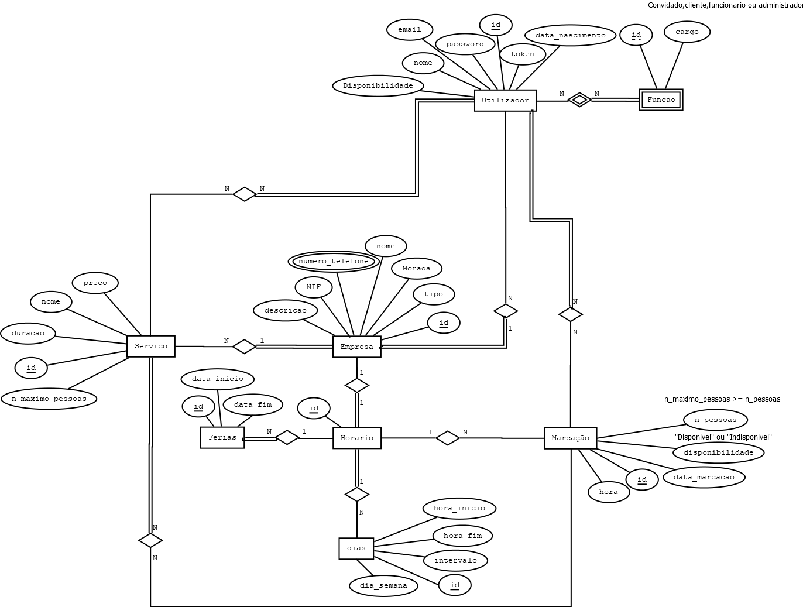

## Appointment

>#### POST
> add an appointment [/appointment] @Params in body

>#### GET
> get specific appointment [/appointment/{id}] @RequestParams data and hour
>
> get specific appointment by date and hour [/appointment]  
> 
> get client info [/appointment/{id}/client]

>#### DELETE
> delete an appointment [/appointment/{id}]

>#### PUT
> change number of people scheduled for that appointment [/appointment/{id}/scheduled] @RequestBody new number
>
> change availability [/appointment/{id}/availability]

## COMPANY

>#### POST
> add a company [/company]  params in body

>#### GET
> get a company [/company/{id}]
>
> get all employees of the company [/company/{id}/employees]
>
> get all services [/company/{id}/services]
>
> get a unique service [/company/{id}/services/{id}]
>
> get all appointments [/company/{id}/appointment]
>
> get a unique appointment [/company/{id}/appointment] @RequestParams data and hour
>
> get open days [/company/{id}/days]
>
> get vacations [/company/{id}/vacation]

>#### DELETE
> delete a company [/company/{id}]

>#### PUT
> change company's address [/company/{id}/address] @RequestBody address
>
> change company's description [/company/{id}/description] @RequestBody description

## Schedule
>#### POST 
> add a schedule [/schedule] @Params in body

>#### GET
> get specific schedule [/schedule/{id}] 
> 
> get all the services available [/schedule/{id}/services]
>
> get all the employees available for the schedule [/services/{id}/employees]
> 
> get all the clients scheduled [/schedule/{id}/client] @RequestParams data and hour

>#### PUT
> update number of people scheduled [/schedule/{id}/client]
>
> update availability scheduled [/schedule/{id}/availability]
> 
>>#### DELETE
> delete a schedule [/schedule/{id}]
 

## Service

>#### POST
> add a service [/service] @Params in body

>#### GET
> get a unique service  [/service/{id}] 
> 
> gets employee for that service [service/{id}/employee]

>#### PUT
> update the price of a service [/service/{id}]
> 
> update the duration of a service [/service/{id}]
> 
> update the maximum number of people [/service/{id}]

>#### DELETE
> delete a schedule [/schedule/{id}]

## Vacation
>#### POST
> add a vacation [/vacation] @Params in body

>#### GET
> get vacation [/vacation/{id}]

>#### PUT
> change beginning and end of vacation [/vacation/{id}] @ RequestBody data_begin data_end

>#### DELETE
> delete a vacation [/vacation/{id}]

## Role
>#### POST
> add a role [/role] @Params in body

>#### GET
> get role [/role/{id}]

## User
>#### POST
> add a user [/user] @Params in body

>#### GET
> get role [/user/{id}/role]
>
> get user [/user/{id}]

>#### PUT
> change role [/user/{id}/role]
> 
> change password [/user/{id}/password]

>#### DELETE
> change role [/user/{id}/role]
>
> change password [/user/{id}/password]

